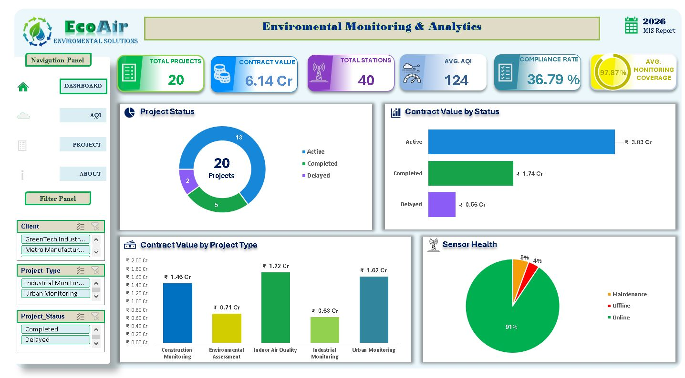
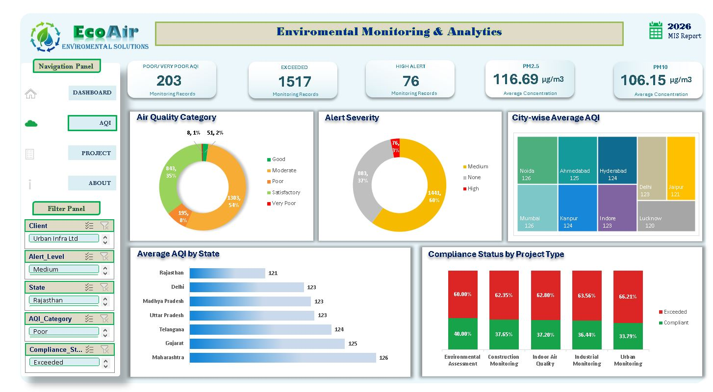
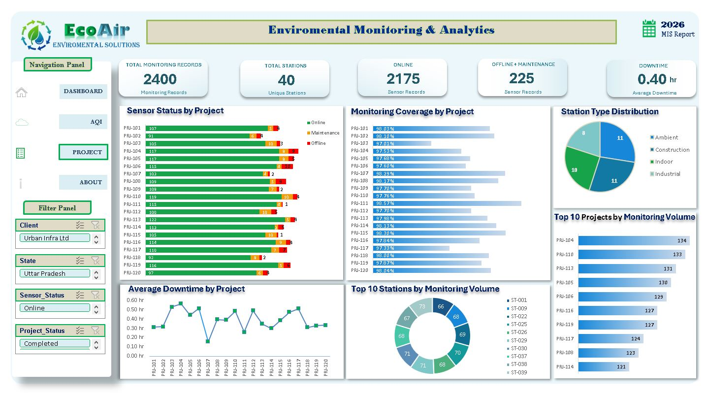

# ECOAIR – Environmental Monitoring & Analytics

## 📊 Project Overview

ECOAIR is a fictional environmental monitoring and analytics project developed in Microsoft Excel to demonstrate practical MIS and Data Analytics skills.

The project analyzes air-quality monitoring, compliance, project performance, sensor status, monitoring coverage and operational reliability.

## 📷 Project Preview

### 1. Executive Dashboard
Provides an overview of project performance, contract value, project status, monitoring stations, AQI and overall monitoring coverage.

### 2. AQI & Compliance
Analyzes air-quality categories, average AQI by state and city, compliance status, and alert severity to identify environmental and compliance risks.

### 3. Project & Monitoring
Tracks monitoring records, sensor status, monitoring coverage, downtime, station distribution and top-performing projects and stations.

## 🛠️ Tools & Techniques

- Excel LTSC 2024
- Power Pivot
- Data Model
- PivotTables
- PivotCharts
- Slicers
- Data Cleaning
- KPI Reporting
- Interactive Dashboard

## 📈 Key Analysis

- Project Status & Contract Value
- AQI Category Analysis
- Compliance & Alert Analysis
- Monitoring Coverage
- Sensor Performance
- Station & Project Monitoring Volume
- Downtime Analysis

## 💡 Key Insights

- 2,400 monitoring records
- 40 monitoring stations
- 20 projects
- 97.87% average monitoring coverage
- 1,517 exceeded records
- 76 high-alert records
- 203 Poor/Very Poor AQI records

## 🔄 Project Approach

**Data → Validation → Data Model → Analysis → KPI → Dashboard → Insights**

## 📌 Disclaimer

ECOAIR is a fictional portfolio project created for learning and demonstration purposes. The dataset is simulated and does not represent actual environmental monitoring records.
